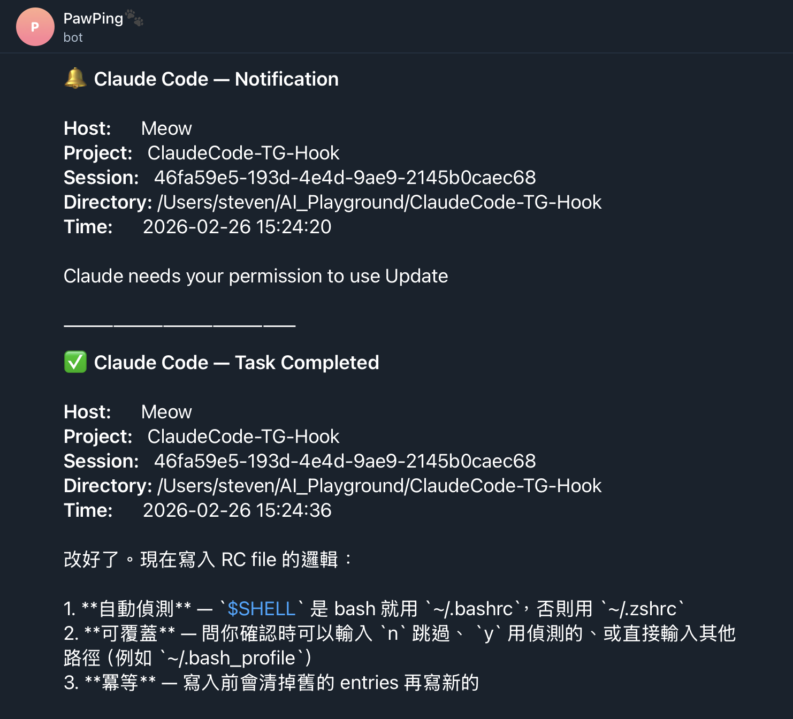

# Claude Code — Telegram Notification Hook

Get Telegram notifications when Claude Code needs your attention or completes a task — and respond directly from Telegram without going back to the terminal.

<p align="center">
  
</p>

## What You Get

- **Permission Required** — Claude needs approval for a tool (e.g., Bash, file edit)
- **Idle / Input Needed** — Claude is waiting for your input
- **Task Completed** — Claude finished its response with a summary
- **Inline keyboard buttons** — tap Yes / No / Continue / Status directly in Telegram
- **Reply to send commands** — reply to any notification message to send a new instruction to that Claude session
- **Transcript context** — notifications include Claude's last message so you know what it's waiting for

## How Two-Way Interaction Works

```
Claude Code
    │  hook event (Notification / Stop)
    ▼
notify-telegram.sh
    │  sends message + inline keyboard buttons
    │  saves  message_id → session_id  to  ~/.claude/tg-sessions.json
    ▼
Telegram  ◀────────────────────────────────────────────────┐
    │  user taps button or replies to message               │
    ▼                                                       │
bot.py  (long-polling getUpdates)                          │
    │                                                       │
    ├─ Completed session (Stop event)                       │
    │       └─▶  claude -p "<command>" --resume <session>  │
    │                   └─▶ response sent back to Telegram ─┘
    │
    └─ Active session (Notification event)
            └─▶ "Please type in terminal: <command>"
                + last assistant message for context
```

> **Note on active sessions:** The Claude Code Hook API does not expose the interactive option list shown in the terminal (e.g. `1. Yes  2. No  3. Type something`). For active sessions, the bot shows Claude's last message as context and asks you to type the response in your terminal. Sending new commands via Telegram works fully for completed sessions.

## Prerequisites

- macOS (Linux works for the hook; the auto-start daemon requires adapting the launchd plist to systemd)
- `jq` and `curl` installed (`brew install jq curl`)
- Python 3 (`python3 --version`)
- [Claude Code](https://claude.com/claude-code) CLI installed
- A Telegram account

## Setup

### 1. Create a Telegram Bot

1. Open Telegram and search for **@BotFather**
2. Send `/newbot` and follow the prompts
3. Copy the **Bot Token** (looks like `123456789:ABCdefGHIjklMNOpqrsTUVwxyz`)

### 2. Get Your Chat ID

1. Start a conversation with your new bot (send any message)
2. Open this URL in your browser (replace `YOUR_BOT_TOKEN`):
   ```
   https://api.telegram.org/botYOUR_BOT_TOKEN/getUpdates
   ```
3. Find `"chat":{"id":123456789}` — that number is your **Chat ID**

### 3. Set Environment Variables

```bash
# Add to ~/.zshrc or ~/.bashrc
export CLAUDE_HOOK_TG_BOT_TOKEN="your-bot-token-here"
export CLAUDE_HOOK_TG_CHAT_ID="your-chat-id-here"
```

Then reload: `source ~/.zshrc`

**Per-project override** — create `<project>/.claude/.env`:
```bash
CLAUDE_HOOK_TG_BOT_TOKEN=project-specific-bot-token
CLAUDE_HOOK_TG_CHAT_ID=project-specific-chat-id
```

Project `.claude/.env` takes priority over system env vars.

### 4. Install the Hook

```bash
git clone https://github.com/Petingo/ClaudeCode-TG-Hook-Notifier.git
cd ClaudeCode-TG-Hook-Notifier
./install.sh
```

The installer will:
- Check that `jq` and `curl` are available
- Ask for your Bot Token and auto-detect Chat ID
- Write credentials to `~/.zshrc` or `~/.bashrc`
- Ask you to choose global or project-level hook installation
- Merge hook config into your Claude Code `settings.json`
- Optionally send a test notification

### 5. Set Up the Interactive Bot

Create `bot/config.json` with your credentials and the path to your `claude` binary:

```json
{
  "bot_token": "your-bot-token-here",
  "chat_id": "your-chat-id-here",
  "claude_path": "/path/to/claude"
}
```

Find your `claude` path with `which claude`.

**Start the bot daemon:**

```bash
./bot/start-bot.sh
```

**Auto-start on login (macOS):**

Edit `bot/com.claudecode.tg-bot.plist` to set the correct paths, then:

```bash
cp bot/com.claudecode.tg-bot.plist ~/Library/LaunchAgents/
launchctl load ~/Library/LaunchAgents/com.claudecode.tg-bot.plist
```

**Stop the bot:**

```bash
./bot/stop-bot.sh
# or
launchctl unload ~/Library/LaunchAgents/com.claudecode.tg-bot.plist
```

### 6. Verify

Start a Claude Code session. Trigger a permission prompt or wait for idle. You should receive a Telegram notification with inline keyboard buttons. Reply to the notification or tap a button — the bot will route your response back to Claude.

## Manual Test

```bash
# Test Notification event (with a real transcript for context)
echo '{
  "hook_event_name": "Notification",
  "session_id": "550e8400-e29b-41d4-a716-446655440000",
  "cwd": "'"$(pwd)"'",
  "notification_type": "idle_prompt",
  "message": "Claude Code needs your attention",
  "permission_mode": "default",
  "transcript_path": "/tmp/test.jsonl"
}' | CLAUDE_HOOK_TG_BOT_TOKEN="..." CLAUDE_HOOK_TG_CHAT_ID="..." \
    ./hooks/notify-telegram.sh

# Test Stop event
echo '{
  "hook_event_name": "Stop",
  "session_id": "550e8400-e29b-41d4-a716-446655440000",
  "cwd": "'"$(pwd)"'",
  "stop_hook_active": false,
  "last_assistant_message": "Task completed successfully.",
  "permission_mode": "default",
  "transcript_path": "/tmp/test.jsonl"
}' | CLAUDE_HOOK_TG_BOT_TOKEN="..." CLAUDE_HOOK_TG_CHAT_ID="..." \
    ./hooks/notify-telegram.sh
```

## Uninstall

```bash
./uninstall.sh
```

Also stop and remove the bot daemon if installed:

```bash
launchctl unload ~/Library/LaunchAgents/com.claudecode.tg-bot.plist
rm ~/Library/LaunchAgents/com.claudecode.tg-bot.plist
```

## How It Works

### Hook script (`hooks/notify-telegram.sh`)

Handles two Claude Code hook events:

| Event | Trigger | Telegram message |
|-------|---------|-----------------|
| `Notification` | Claude needs attention | Emoji + type + project info + last transcript message + inline keyboard |
| `Stop` | Claude finishes a response | Summary + last assistant message + inline keyboard |

After sending, the script captures the Telegram `message_id` and writes a session record to `~/.claude/tg-sessions.json`. This is how the bot knows which Claude session a reply belongs to.

### Bot daemon (`bot/bot.py`)

A Python 3 process using **Telegram long polling** (`getUpdates` with `timeout=30`). No webhook, no public URL required.

When a button press or reply arrives:

1. Looks up the session from `~/.claude/tg-sessions.json` by `message_id`
2. Checks whether the Claude session is still active (`pgrep`)
3. **Completed session** → runs `claude -p "<command>" --resume <session_id>` and sends the response back to Telegram
4. **Active session** → sends "please type in terminal" with transcript context

### Key design choices

- **`async: true`** — hook network I/O never blocks Claude
- **`exit 0` always** — hook failures are silent
- **`stop_hook_active` guard** — prevents infinite loops on Stop events
- **`CLAUDECODE` env stripping** — prevents "nested session" error when spawning `claude -p` from within a Claude Code environment
- **Zero Python dependencies** — bot uses only stdlib (`urllib.request`, `subprocess`, `threading`)

### Message format

```
🔔 Claude Code — Notification

Host:      MacBook
Project:   my-web-app
Session:   abc123-def456
Directory: /Users/you/projects/my-web-app
Time:      2026-02-26 14:30:45

Claude Code needs your attention

📋 Last message:
Should I proceed with the changes? (yes/no)

💬 Reply to this message or tap a button to send a command
——————————————
[✅ Yes]  [❌ No]
[▶️ Continue]  [📊 Status]
```

## File Structure

```
ClaudeCode-TG-Hook-Notifier/
├── hooks/
│   └── notify-telegram.sh   # Claude Code hook (Notification + Stop events)
├── bot/
│   ├── bot.py               # Telegram long-polling bot daemon
│   ├── config.json          # Bot credentials + claude binary path (create manually)
│   ├── start-bot.sh         # Start daemon
│   └── stop-bot.sh          # Stop daemon
├── install.sh               # Interactive hook installer
└── uninstall.sh             # Hook uninstaller
```

## Troubleshooting

**No notifications received?**
- Check `echo $CLAUDE_HOOK_TG_BOT_TOKEN $CLAUDE_HOOK_TG_CHAT_ID` — both must be set
- Run the manual test command above
- Make sure you sent a message to the bot before testing

**Buttons missing?**
- Inline keyboard buttons appear in the Telegram chat view, not in the lock-screen notification preview. Open the chat to see them.

**Bot not responding to replies?**
- Check `bot/bot.log` for errors
- Verify `bot/config.json` exists with correct credentials
- Check `launchctl list | grep tg-bot` — the service should show a PID

**"Sending to Claude" stuck?**
- This happens when trying to resume an active Claude session. The bot now detects this automatically and falls back to terminal instructions instead.

**`claude` not found by bot?**
- Set `claude_path` in `bot/config.json` to the absolute path from `which claude`

**`jq` not found?**
- Install with `brew install jq`
- The script checks `/opt/homebrew/bin/jq` first, then `$PATH`

**Permission errors?**
- Run `chmod +x hooks/notify-telegram.sh bot/start-bot.sh bot/stop-bot.sh`

## License

MIT
